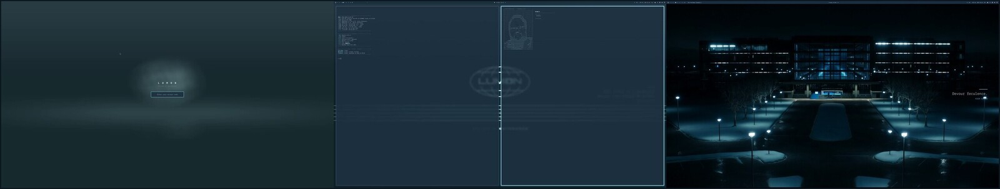

<div align="center">

```
███░            ░██▓           ▒██▒ ▓███▓           ░▓███▒  ▒██████████████▒  ▒███▒         ░███
███░            ░██▓           ▒██▓ ▓████▓░        ░█████▒ ▓████████████████▓ ▒█████▒       ░███
███░            ░██▓           ▒██▓ ▓██▓███░      ▒██▓▓██▒ ███████▓ ░▓██████▓ ▒██▒▒███▒     ░███
███░            ░██▓           ▒██▓ ▓██▒░███▒    ▓██▓ ▒██▒ ██████▒    ▒█████▓ ▒██▒  ▒███▒   ░███
███░            ░██▓           ▒██▓ ▓██▒  ▓██▒  ▓██▒  ▓██▒ ██████░    ░█████▓ ▒██▒    ░███▓ ░███
███░            ░██▓░          ▒██▒ ▓██▒   ▒██████░   ▓██▒ ███████▒ ░▒██████▓ ▒██▒      ░▓██████
████████████████▒▓████████████████░ ▓██▒    ▒████░    ▓██▒ ▒████████████████▒ ▒██▒        ░▓████
```

# Omarchy · Lumon Industries

**A whole-system _Severance_ theme for [Omarchy](https://omarchy.org).**

<sub>B O O T · L O C K · G R E E T · W A L L P A P E R · S C R E E N S A V E R · T H E M E · Q U O T E</sub>

</div>

---

> *Welcome. The remembering you will do here is a gift.*

Every moment of using the machine, refined into one face. The Plymouth globe while it
boots. The *"enter your access code"* lock screen. A short animation in the first
terminal of the day. The severed-floor crew looking back at you from the wallpaper.
An ambient reel when you step away. Colour, blur and shadow tuned to match. And a
single quote, placed gently on the desktop, refreshed before it wearies.

Each piece is its own repository — enroll the whole department or just the roles you
need. Everything installs **on top of** Omarchy's own code (patches, plugins,
marker-guarded blocks), so `omarchy update` never severs it, and every repo ships an
`uninstall.sh`.

<div align="center">



<sub>Lock → greeting → screensaver → wallpaper. Boot splash and theme not yet photographed.</sub>

</div>

---

## The department

| Role | Function | Preview |
|---|---|---|
| **[omarchy-lumon-boot](https://github.com/KaiCryan/omarchy-lumon-boot)** | Plymouth boot splash — the Lumon globe on the dark ground, with a matching prompt for encrypted disks | <!-- docs/boot.jpg --> |
| **[omarchy-lumon-lock](https://github.com/KaiCryan/omarchy-lumon-lock)** | Lock screen — asks for your *access code*, **L U M O N / United in Severance** caption, stays lit 60s after a wake | <a href="https://github.com/KaiCryan/omarchy-lumon-lock#readme"></a> |
| **[omarchy-lumon-greeting](https://github.com/KaiCryan/omarchy-lumon-greeting)** | Terminal greeting — 19 animations (the globe, the descent, an MDR bin filling, Defiant Jazz…), then `fastfetch` | <a href="https://github.com/KaiCryan/omarchy-lumon-greeting#readme"></a> |
| **[omarchy-lumon-wallpapers](https://github.com/KaiCryan/omarchy-lumon-wallpapers)** | Real severed-floor stills — the corridor, the elevator, the MDR office — plus stop-motion opening-titles frames, official key art, and a clean 4K brand piece, with an hourly cycler | <a href="https://github.com/KaiCryan/omarchy-lumon-wallpapers#readme"></a> |
| **[omarchy-lumon-screensaver](https://github.com/KaiCryan/omarchy-lumon-screensaver)** | Capped-fps `ttfx` effects + an ambient reel of eight looping scenes. Holds back while a video is playing. | <a href="https://github.com/KaiCryan/omarchy-lumon-screensaver#readme"></a> |
| **[omarchy-lumon-theme](https://github.com/KaiCryan/omarchy-lumon-theme)** | The connective tissue — colour scheme, Hyprland look'n'feel (gaps, blur, cyan drop shadow), `fastfetch` + `omarchy about` branding | <!-- docs/theme.jpg --> |
| **[omarchy-desktop-quote](https://github.com/KaiCryan/omarchy-desktop-quote)** | A rotating quote placard over the wallpaper, behind your windows. Plain-text quotes file, hot-reloaded, with an auto-position mode that finds whichever side of the wallpaper has more empty space. | <!-- docs/quote.jpg --> |
| **[omarchy-lumon-assets](https://github.com/KaiCryan/omarchy-lumon-assets)** | Shared materials — ASCII art, font list, build tools the other repos draw from | — |

---

## Onboarding

```sh
git clone https://github.com/KaiCryan/omarchy-lumon
cd omarchy-lumon
./install-all.sh
```

`install-all.sh` clones each repository into `~/.local/share/omarchy-lumon/` and runs
its installer in order. It pauses to ask before the one step that needs `sudo` (the
boot splash). Decline any role you'd rather not fill:

```sh
./install-all.sh --skip boot --skip quote
```

Or simply follow the install steps in whichever individual repos you want.

## Severance

Run `./uninstall.sh` in each repo you enrolled (or `./uninstall-all.sh` here), then
`omarchy theme set <something-else>` to release the Lumon colours. You will not
remember the wallpapers. This is by design.

---

<div align="center">
<sub>

*The work is mysterious and important.*

A personal, non-commercial *Severance* tribute · not affiliated with Apple TV+ or the production.<br>
Wallpapers mix real stills, opening-titles frames, and official key art — see <code>wallpapers/SOURCES.md</code> in the wallpapers repo.

</sub>
</div>
